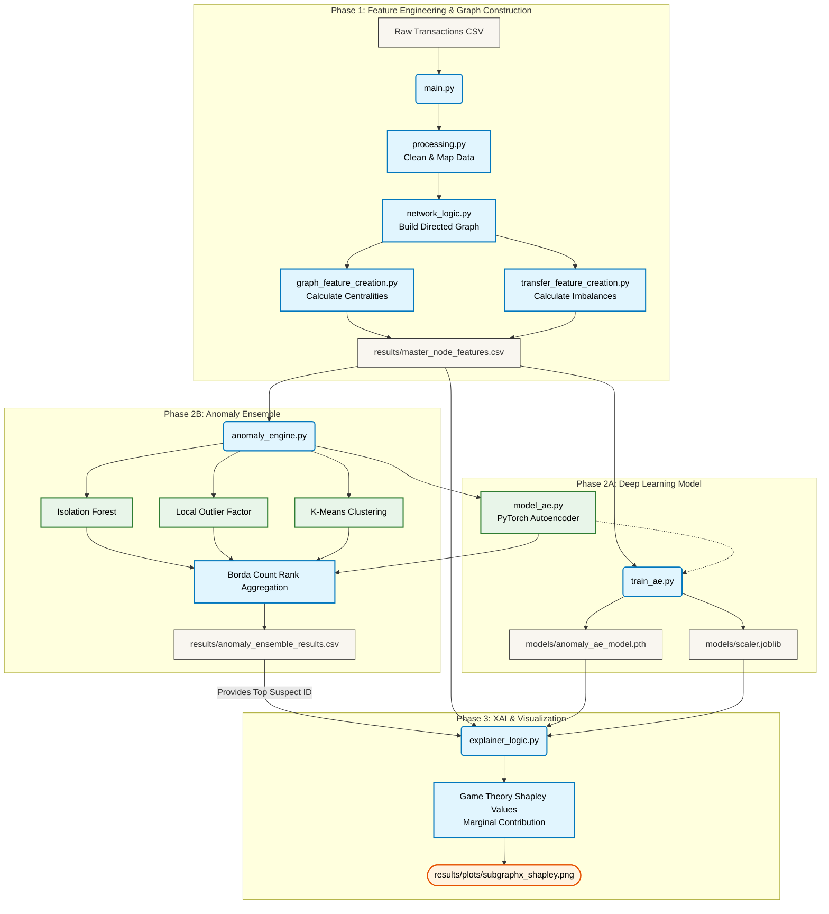

#SubgraphX: Directed Network Feature Engineering Pipeline


##Overview
This repository contains a highly optimized, scalable Python pipeline designed to extract structural and domain-specific features from large-scale directed transfer networks (e.g., supply chains, logistics, or transactional networks). 

It acts as the critical feature-engineering phase for downstream **Graph-based Anomaly Detection** and **Graph Explainability** models. The pipeline is specifically optimized to handle massive graphs (100k+ nodes, 200k+ edges) by utilizing Pandas vectorization and supporting pre-calculated structural metrics to bypass standard computational bottlenecks.

##A Primer on Graph Explainability & SubgraphX
*Why do we need this pipeline?*

In modern machine learning, Graph Neural Networks (GNNs) are used to detect anomalies in complex networks (like fraudulent transactions or supply chain bottlenecks). However, GNNs act as "black boxes." 

**Explainability algorithms** (like the *SubgraphX* algorithm) solve this by identifying the specific subset of nodes and edges (the "subgraph") that caused the GNN to flag an anomaly. 
**However, for these explainers to work accurately, the initial graph must be incredibly feature-rich.**

This pipeline bridges that gap by transforming raw tabular data into rich node-level vectors consisting of:
1. **Structural Features:** How important is this node to the network? (Centralities, Degrees).
2. **Domain Features:** What is the physical nature of the transfers happening here? (Imbalances, Quantities, Hazards).

##Core Capabilities
* **Domain Feature Generation:** Calculates weighted degree imbalances, transactional quantity differences, and node demographics in $O(1)$ time via vectorized aggregations.
* **Gephi Fast-Track Integration:** Allows the ingestion of pre-calculated $O(V \times E)$ graph centralities (e.g., Betweenness, PageRank) from Gephi, merging them seamlessly with transactional domain features.
* **Interactive Execution:** CLI-based prompts allow users to test on dataset subsets, recalculate features from scratch, or execute a "Super Fast-Track" mode that merges cached metrics in seconds.
* **Global Graph Summarization:** Automatically generates comprehensive statistical fingerprints (Mean, Min, Max) of the entire network per run for temporal tracking.

##Phase 2: Ensemble Anomaly Detection & Rank Aggregation
Because illicit supply chain activities lack extensive labeled ground-truth data, SubgraphX employs an **Unsupervised Machine Learning Ensemble** to detect anomalous physical transfers. 

To overcome the inherent biases and scale differences of individual algorithms, the pipeline forces a mathematical consensus using **Borda Count Rank Aggregation**.

### 1. The Four-Model Ensemble
The system evaluates the engineered master node features through four distinct mathematical perspectives:
* **Deep Autoencoder (AE):** Compresses node features into a latent space and attempts reconstruction. Nodes with high Reconstruction Error (MSE) are flagged as anomalies.
* **Isolation Forest (IF):** Isolates anomalies via random partitioning. Nodes requiring fewer cuts to isolate receive higher anomaly scores.
* **Local Outlier Factor (LOF):** Measures the local density deviation of a given node with respect to its nearest neighbors.
* **K-Means Clustering:** Groups the network into latent clusters. A node's anomaly score is derived from its distance to its assigned cluster centroid.

### 2. Borda Count Consensus
Raw scores from these models cannot be aggregated directly due to drastically different scales (e.g., MSE vs. Euclidean Distance). 
To solve this, the pipeline applies a **Rank Transformation**:
1. **Rank Equalization:** Each model independently ranks every node in the network from `1` (Normal) to `N` (Highly Anomalous).
2. **Aggregation:** The system calculates a final `Borda_Score` by summing the four independent ranks for each node.

**The Result:** A node only achieves a high `Borda_Score` if *multiple* distinct algorithms independently agree it is mathematically highly suspicious, drastically reducing false positives and identifying high-confidence fraud rings for downstream explainability (via NetworkX Ego-Graphs).

---

##Prerequisites & Setup

###Prerequisites
* **OS:** Linux, macOS, or Windows
* **Python:** v3.10 or higher
* **Memory:** 8GB+ RAM recommended for graphs exceeding 150,000 nodes.


### Installation

**1. Clone the repository:**
```bash
git clone [https://github.com/YOUR-USERNAME/subgraphx.git](https://github.com/YOUR-USERNAME/subgraphx.git)
cd subgraphx
```

## Pipeline Architecture

